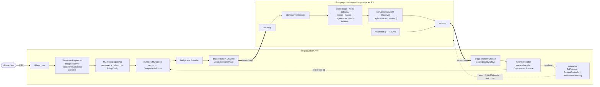

# Архитектура

Как одна операция HBase проходит через go-hbase, что где выполняется и
что происходит при сбоях.

## Компоненты
| Слой                 | Java                                                                         | Go                                                       |
|----------------------|------------------------------------------------------------------------------|----------------------------------------------------------|
| Поверхность observer | `bridge.observer.*ObserverAdapter` (Region/Master/RegionServer/WAL/BulkLoad) | интерфейсы `pkg/hbasecop` + встраивания `Unimplemented*` |
| Dispatch             | `MuxHookDispatcher` $\rightarrow$ `multiplex.Multiplexer`                                | `dispatch.go` + hook-таблицы для каждой поверхности      |
| Wire-кодек           | `bridge.wire.Encoder/Decoder`                                                | `internal/wire`                                          |
| Транспорт            | `bridge.shmem.Channel`                                                       | `internal/shmem.Channel`                                 |
| Жизненный цикл       | `CoprocessorRuntime`, `SharedRuntime`, `supervisor.*`                        | `internal/cpruntime.Loop`                                |

`ChannelReader` — это reader-thread внутри `CoprocessorRuntime`, а не отдельный
файл. Endpoint / reverse-RPC путь показан второй схемой ниже.

### Endpoint / reverse-RPC путь

Здесь инициатор — **клиент** (а не HBase): он зовёт серверный Go-endpoint, а
запущенный handler может делать **обратные** RPC в свой регион (server-side
read / write — scan, GET, MUTATE) через канал `RpcRequest` / `RpcResponse`.

```mermaid
%%{init: {'flowchart': {'nodeSpacing': 55, 'rankSpacing': 110, 'curve': 'basis', 'padding': 15}}}%%
flowchart LR
    subgraph EXT[" "]
       client(["HBase client / Admin"])
    end
   

    subgraph GOE["Go-процесс"]
        direction TB
        dispE["dispatchEndpoint<br/>pkg/hbasecop/endpoint.go"]
        ep["пользовательский Endpoint<br/>Call(ctx, env, method, payload)"]
        env["EndpointEnv<br/>env.Get / OpenScanner / Put"]
    end

    subgraph RSE["RegionServer JVM"]
        direction TB
        svc["GoEndpointServiceImpl<br/>bridge.endpoint — proto 2.5.0 Service"]
        invoker["EndpointInvoker $\rightarrow$<br/>CoprocessorRuntime.invokeEndpoint"]
        rev["ReverseRpcServicer.accept<br/>bridge.rpc"]
        reg["RegionRegistry · ScannerRegistry"]
        region["Region — get / getScanner / mutate"]
    end

    client -->|"coprocessorService<br/>(GoEndpointService)"| svc
    svc --> invoker
    invoker ==>|"EndpointInvoke (ring)"| dispE
    dispE --> ep
    ep <-->|"reverse read/write"| env

    env ==>|"RpcRequest (ring)"| rev
    rev --> reg --> region
    region -->|cells| rev
    rev ==>|"RpcResponse (ring)"| env

    ep ==>|"EndpointResult (ring)"| svc
    svc -->|"byte[] результат"| client

    style EXT fill:none,stroke:none
```

## Поток запроса (строгий pre-hook, например `prePut`)

1. **Срабатывает hook.** HBase вызывает `RegionObserverAdapter.prePut(...)` в
   потоке RPC-обработчика.
2. **Сериализация.** Адаптер конвертирует типы HBase в вендорённые protobuf-
   сообщения (`MutationConverter`, `CellConverter`, ...), оборачивает их в
   per-hook-запрос (`PrePutRequest`) плюс `HookContext` (table, region).
3. **Dispatch.** `MuxHookDispatcher` разрешает per-hook политику + таймаут
   (`PolicyConfig`); `Multiplexer.callTracked` выделяет монотонный
   `req_id`, регистрирует `CompletableFuture`, кодирует `REQUEST`-фрейм и
   отправляет его в кольцо Java$\rightarrow$Go.
4. **Wire.** Один фрейм big-endian, максимум 64 KiB (`MaxFrameSize`).:

   | u32 len | u8 type | u64 req_id | u32 region_id | u8 hook_id | u8 flags | u32 chunk_idx | u32 chunk_total | protobuf |
   |---------|---------|------------|---------------|------------|----------|---------------|-----------------|----------|

   Декодеры ограничивают `chunk_total` (`MaxChunks` = 1024) и число одновременных пересборок. Боевые payload'ы укладываются в один chunk, так что держите размер payload ниже потолка фрейма.
5. **Go получает.** Reader-goroutine из `cpruntime` опрашивает ring, декодирует
   фрейм и порождает по одной goroutine на запрос.
6. **Пользовательский код.** Dispatcher разбирает per-hook-запрос, ищет
   запись в hook-таблице и вызывает ваш метод observer'а. Возвращённая ошибка (или
   восстановленная **паника**) становится `HookResponse.error`; `Bypass`,
   `BlockedIndices` и `ResultCells` копируются в `HookResponse`.
7. **Ответ.** Фрейм ответа идёт в единственную writer-goroutine и
   далее в кольцо Go$\rightarrow$Java.
8. **Java завершает.** `ChannelReader` декодирует его, `Multiplexer.deliver`
   завершает future для этого `req_id`. По таймауту dispatcher отменяет
   вызов и удаляет его из map ожидающих.
9. **Применение.** Адаптер отображает `HookResponse`: 
   - `bypass=true` $\rightarrow$ `ObserverContext.bypass()` (с защитой: WARN там, где HBase это не разрешает);
   - `error` $\rightarrow$ политика:
     - `strict` $\rightarrow$ `IOException`, операция клиента прерывается 
     - `best-effort` $\rightarrow$ WARN + продолжение
   - bypass для `PreAppend`/`PreIncrement` возвращает `Result`, построенный из `ResultCells`.

Post-hook'и идут тем же путём; при дефолтной best-effort политике их
сбои никогда не прерывают host-операцию. Сейчас они всё ещё *ждут*
ответ от Go синхронно, ограниченные таймаутом hook'а.

## Модель процесса

**Один Go-процесс на coproc-jar на RegionServer**, разделяемый между всеми
регионами и таблицами, использующими этот jar: первый `start()` порождает его через
`SharedRuntime.acquire(key, ...)` (с подсчётом ссылок), последующие start'ы
подключаются, последний `stop()` останавливает его (`SHUTDOWN`-фрейм $\rightarrow$
graceful-ожидание $\rightarrow$ force-kill).
Каждый регион получает `region_id` от `RegionIdAllocator` при старте observer'а;
он едет в заголовке фрейма, так что сторона Go скоупит `ObserverEnv` per region.

**Запуск:** `CoprocessorRuntime.start()` открывает два mmap-файла ring'ов,
читает `HbaseCop-Go-Bin-SHA256` из манифеста jar'а, извлекает встроенный
ELF, **проверяет дайджест** (несовпадение $\rightarrow$ fail-fast; защищает от
повреждения/неверной архитектуры, это не схема подписи), запускает его с
окружением `HBASECOP_*` и стартует reader-поток + планировщик supervisor'а.

## Модель конкурентности (как построено)

- **Go:** одна reader-goroutine, одна writer-goroutine, одна heartbeat-
  goroutine и **по одной goroutine на каждый запрос в полёте**. Никакого глобального mutex на
  горячем пути; backpressure через ограниченную исходящую очередь (256).
- **Java:** один reader-поток на runtime; вызывающие hook блокируются на своём
  future; отправки в ring сериализованы lock'ом (SPSC ring).
- **Упорядочивание: никакого, кроме собственного у HBase.** Запросы из разных регионов
  и конкурентные запросы из одного региона выполняются конкурентно на
  стороне Go. Здесь **нет per-region сериализации и нет lifecycle-барьера**:
  состояние observer'а должно быть безопасным для конкурентного использования (используйте атомики/локи).
  `docs/architecture/concurrency.md` описывает *будущий* per-region actor-
  дизайн, который **не реализован**.

Пропускная способность масштабируется с числом ядер и не показывает head-of-line blocking между
регионами (бенч: `docs/bench/t62-region-concurrency.md`).

## Режимы отказа

| Отказ                                    | Обнаружение                                                                            | Последствие                                                                                                            |
|------------------------------------------|----------------------------------------------------------------------------------------|------------------------------------------------------------------------------------------------------------------------|
| Go возвращает ошибку / паникует          | ответ несёт `HookResponse.error`                                                       | per-hook политика:   strict $\rightarrow$ клиентский `IOException`  best-effort $\rightarrow$ WARN + продолжение |
| Go медленный / не отвечает               | per-hook таймаут (по умолчанию 5s)                                                     | политика, как выше; ожидающий вызов отменяется                                                                         |
| Go-процесс завершается                   | тик supervisor'а (`detectExitedGoProcess`, работает даже при отключённых heartbeat'ах) | future в полёте падают (`GoSideCrashed`); рестарт с backoff от 200 ms до 5 s (×2, jitter ±20%)                         |
| Go-процесс завис                         | 3 пропущенных heartbeat'а по 500 ms                                                    | SIGKILL, затем путь рестарта выше                                                                                      |
| Рестарты продолжают падать               | `max-fails` (5) последовательных отказов                                               | помечен как нездоровый; hook'и сразу падают по политике; проба каждые 30 s                                             |
| Вызовы во время окна рестарта            | n/a                                                                                    | паркуются до `hbasecop.restart.deadline` (3 s), затем падают по политике                                               |
| Повреждённый/неверный ELF в jar          | SHA-256 против манифеста при извлечении                                                | coprocessor не стартует, понятное сообщение в логе                                                                     |
| Некорректные/слишком большие wire-фреймы | границы декодера (длина, тип, `MaxChunks`, потолок ожидающих)                          | фрейм отвергается с ошибкой; никогда не происходит неограниченной аллокации                                            |

Проверено end-to-end матрицей fault-injection (`make test-fault`,
10 кейсов: {strict, best-effort} × {kill -9, hang, exit-1, OOM, error}),
утверждающей корректную семантику, отсутствие потери данных, отсутствие двойного применения и восстановление.

## Ключевые лимиты и значения по умолчанию

| Лимит | Значение | Где |
|---|---|---|
| Максимальный wire-фрейм | 64 KiB | `internal/wire.MaxFrameSize` / `WireFormat.MAX_FRAME_SIZE` |
| Максимум chunk'ов / ожидающих пересборок | 1024 / 4096 | оба декодера |
| Ring | ёмкость 16 слотов × 1 MiB | значения по умолчанию `CoprocessorRuntime.Config` |
| Таймаут hook'а | 5 s | `hbasecop.timeout.default` |
| Heartbeat / порог пропусков | 500 ms / 3 | `hbasecop.heartbeat.*` |
| Backoff рестарта / нездоровый / проба | 200 ms$\rightarrow$5 s ±20% / 5 отказов / 30 s | `hbasecop.restart.*` |

Все значения переопределяются ключами `hbasecop.*` из HBase `Configuration`
(`hbase-site.xml` или дескриптор таблицы); основные сведены в таблице выше.
